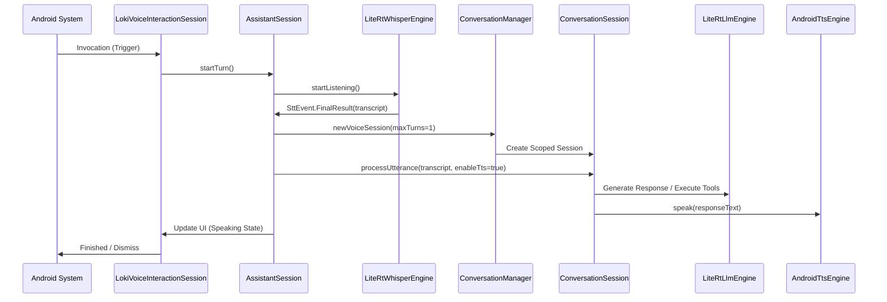

# Voice Assistant Workflow Exploration

This document summarizes the architectural exploration of the **Voice Assistant Workflow** in the Loki project, based on the `openspec/changes/voice-assistant-workflow` specifications and current core implementations.

## Architecture Overview

The voice assistant follows a decoupled multi-layer architecture, ensuring clean boundaries between voice capture, reasoning, tool execution, and response delivery.

## Key Components

### 1. Voice Interaction Layer
- **[LokiVoiceInteractionSession](file:///Users/aryanyadav/Documents/Development/MobileApp/Loki/core/assistant/src/main/java/dev/loki/android/core/assistant/LokiVoiceInteractionSession.kt)**: Manages the `VoiceInteractionSession` lifecycle and the Compose overlay UI (`VoiceSessionOverlay`).
- **[AssistantSession](file:///Users/aryanyadav/Documents/Development/MobileApp/Loki/core/assistant/src/main/java/dev/loki/android/core/assistant/AssistantSession.kt)**: The primary coordinator for a voice turn. It manages `AssistantState` and coordinates STT, Conversation, and TTS stages.

### 2. Speech-to-Text (STT) Layer
- **[LiteRtWhisperEngine](file:///Users/aryanyadav/Documents/Development/MobileApp/Loki/core/voice/stt/src/main/java/dev/loki/android/core/voice/stt/LiteRtWhisperEngine.kt)**:
    - Implements `SttEngine`.
    - Uses `AudioRecorder` for 16kHz PCM capture.
    - Optimized for **LiteRT Whisper-Tiny** model.
    - Standardizes on a 30-second fixed window for processing.

### 3. Agent & Conversation Layer
- **[ConversationManager](file:///Users/aryanyadav/Documents/Development/MobileApp/Loki/core/conversation/src/main/java/dev/loki/android/core/conversation/ConversationManager.kt)**:
    - Enforces a **Single-Turn Policy** (`maxTurns = 1`) for voice sessions to minimize latency.
    - Creates scoped `ConversationSession` instances.
- **ConversationSession**: Orchestrates the LLM (Gemma/Qwen via LiteRT) and the Tool System.

### 4. Text-to-Speech (TTS) Layer
- **[AndroidTtsEngine]**: (Referenced in `AssistantSession`) Handles playback using the system TTS service.

## Multi-Stage Cancellation

A critical feature of the workflow is the robust cancellation pipeline implemented in `AssistantSession.cancelTurn()`:
- **STT**: Stops the `AudioRecorder` immediately.
- **LLM**: Cancels the active generation job.
- **TTS**: Stops active audio playback.
- **UI**: Resets the state machine to `Idle`.

## Exploration Summary

The implementation strictly adheres to the design specified in `openspec/changes/voice-assistant-workflow/design.md`. The workflow is highly modular, allowing for easy replacement of components (e.g., swapping TTS providers or LLM engines) while maintaining the core interaction logic.
