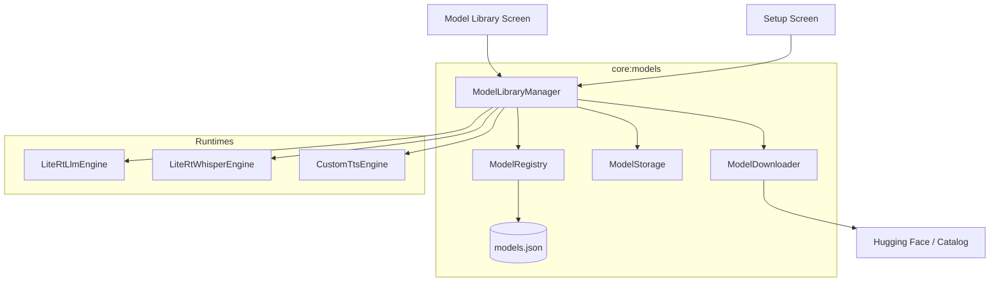

# Design: Centralized Model Management

## Component Interaction



## Schema Evolution

### ModelRuntime
```kotlin
enum class ModelRuntime {
    LITERT_LM,    // LLM Reasoning
    LITERT_ASR,   // Whisper Transcription
    LITERT_TTS,   // Future: Custom Voice Synthesis
}
```

### ModelRegistry Map
The `activeModelId` field in `ModelManifest` will be deprecated in favor of `activeModels: Map<ModelRuntime, String>`. During the first run, the registry will migrate the old field into the map under `LITERT_LM`.

### Multi-Artifact Support
`ModelRecord` will be updated to include a list of artifacts:
```kotlin
data class ModelArtifact(
    val fileName: String,
    val relativePath: String, // e.g. "tokenizer.json"
    val sizeBytes: Long,
    val sha256: String? = null,
    val url: String // Download source
)
```

## Storage Strategy
All models will reside in:
`/data/user/0/dev.loki.android/files/models/{modelId}/`

Files will be stored using their `relativePath` defined in the artifact list.

## Runtime Controller Registry
`ModelLibraryManager` will allow runtimes to register themselves:
```kotlin
fun registerRuntime(runtime: ModelRuntime, controller: ModelRuntimeController)
```
This decoupling ensures `:core:models` doesn't need to depend on the heavy runtime implementations. `ModelLibraryManager` owns the state flow, while the controller handles the low-level `load()` call (e.g. LiteRT Interpreter initialization).
